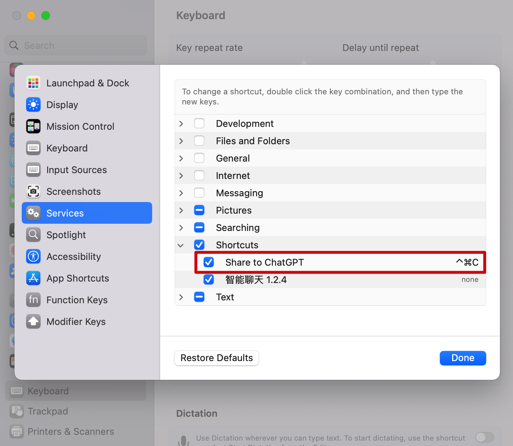
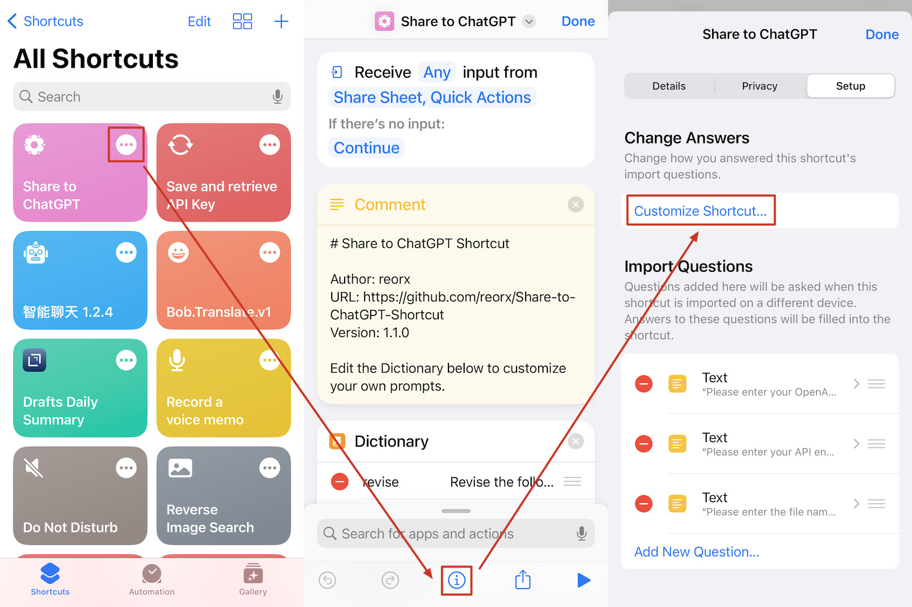

# Share to ChatGPT Shortcut

The Share to ChatGPT feature is an Apple Shortcut that allows users to share highlighted text to ChatGPT while also including personalized prompts. Additionally, the response message will automatically be copied to the user's clipboard.

## Installation

The shortcut is released on RoutineHub, you can install it from there:

https://routinehub.co/shortcut/14636/

Or install from the direct link on iCloud:

https://www.icloud.com/shortcuts/e4b04e34183a4d288b5880c0515ea673

While installing, the shortcut will ask you to enter your OpenAI API key. If you don't have one, you can get one from the OpenAI dashboard.

## Usage

After installation, the shortcut will be available in the Shortcuts app. Follow the steps below to initialize the shortcut:

1. Open the shortcut
2. Type something like "hello" for testing purpose, and choose a built-in prompt like "chat".
3. Click "Allow" for every confirmation dialog.

| Step 1 | Step 2 | Step 3 |
| :----: |:------:|:------:|
|  |  | |

To create an easily accessible shortcut for daily use, follow these steps:

1. Open the share sheet by highlighting some text and tapping the share button.
2. Scroll to the bottom and select "Edit Actions".
3. Scroll to the bottom again and choose "Share to ChatGPT".
4. This will place the shortcut at the top of the share sheet for easy access.

| Step 1 | Step 2 | Step 3 | Step 4 |
| :----: |:------:|:------:|:------:|
|  |  |  |  |

Finally, let's see how to use the shortcut in action. Here's an example to use the shortcut to revise a sentence:

1. Highlight the text and click "Share" in the tooltip
2. Click "Share to ChatGPT" in the share sheet
3. Choose "revise" in the dialog
4. Preview the result, which has already been copied to the clipboard

| Step 1 | Step 2 | Step 3 | Step 4 |
| :----: |:------:|:------:|:------:|
|  |  |  |  |

## Accessibility

### Keyboard Shortcut

On MacOS, you can set a global keyboard shortcut to run this shortcut. To do this, open the "Keyboard" preference pane, select "Shortcuts", select "Services" on the left, and then select "Share to ChatGPT" in the "Shortcuts" section. You can then set a keyboard shortcut for it.



### iPhone Back Tap

Run this shortcut by tapping the back of your iPhone: 1. On your iPhone, go to Settings > Accessibility > Touch. 2. Scroll down, then select Back Tap. 3. Select either Double Tap or Triple Tap. 4. Scroll down to the Shortcuts area, then choose Rephrase With GPT.

Tap Back Tap to apply the setting.

## Prompts

The shortcut has the following built-in prompts.

| Prompt | Content |
| ------ | ------- |
| revise | Revise the following sentences to make them more clear concise and coherent |
| summarize | Summarize the following text |
| translate | Translate the following text to English |
| chat | - |

The message sent to ChatGPT is generated by concatenating the prompt and the shared text. For example if you choose the "revise" prompt and share the text "nice to see you", the message will be:

```
Revise the following sentences to make them more clear concise and coherent:

nice to see you
```

> Please note that the chat prompt is a special prompt that is empty. It will directly pass the shared text without modification.

You can also add your own prompts by editing the shortcut.


## Configuration

The configuration is stored in the shortcut, you can change them by clicking the "…" sign of this shortcut in the Shortcuts app, and then click the ⓘ symbol at the bottom of the screen, and then click "Customize Shortcut" to open the configuration dialog.



Here's the meaning of each configuration item:
- `API-key`: Your OpenAI API key
- `API-base-url`: The base URL of the API endpoint. By default it's `https://api.openai.com/v1/`. You can change it to use a different API endpoint if you understand this setting.
- `history-file`: The file name to store messages history. The history file path would be `iCloud Drive/Shortcuts/Share-to-ChatGPT/$date/$history-file`. If omitted, messages will not be recorded.

## Changelog

- 2023-03-25 - [1.0.0](https://www.icloud.com/shortcuts/9cd41f860ef2473aa9d69931b1cb0e19) - Initial release.
- 2023-03-26 - [1.0.1](https://www.icloud.com/shortcuts/ce93205ebd5a4ec89a983552963f26f8) - Fix a bug that the shortcut cannot determine empty user input properly.
- 2023-03-26 - [1.0.2](https://www.icloud.com/shortcuts/612139e1d1f1416d858d49b638fc14d6) - Enhance error output.
- 2023-03-26 - [1.1.0](https://www.icloud.com/shortcuts/e4b04e34183a4d288b5880c0515ea673)
  - Store configuration in the shortcut setup by utilizing the "Import Questions" feature. No config file anymore.
  - Add message history support. When history file name is set, the shortcut will record messages in the history file.

## Credits

- This project was inspired by [ChatGPT-Siri](https://github.com/Yue-Yang/ChatGPT-Siri) and it provided me with valuable assistance while working with Shortcuts.app's editor.
- [Rephrase With GPT](https://routinehub.co/shortcut/14625/) is a similar shortcut focuses on rephrasing text. It's a great shortcut and I highly recommend it.
