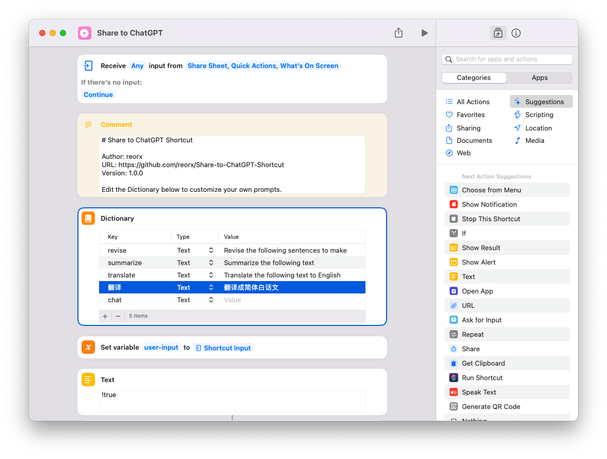

# Share to ChatGPT Shortcut

The Share to ChatGPT feature is an Apple Shortcut that allows users to share highlighted text to ChatGPT while also including personalized prompts. Additionally, the response message will automatically be copied to the user's clipboard.

## Installation

Download and install the shortcut at:
https://www.icloud.com/shortcuts/9cd41f860ef2473aa9d69931b1cb0e19

## Setup and Usage

After installation, the shortcut will be available in the Shortcuts app. Follow the steps below to set up the shortcut:

1. Open the shortcut
2. After clicking "Done," enter your OpenAI API key in the dialog box. You will then receive a notification that confirms the configuration path.
3. Type something like "hello" for testing purpose, and choose a builtin prompt like "chat".
4. Click "Allow" for every confirmation dialog. Note that you'll see a confirmation for allowing to send "1 dictionary" to "api.openai.com" the next time you run the shortcut, which looks kinda weird but is just a side-effect of storing the API key in a file, you should click "Always Allow" to make the shortcut work properly.

| Step 1 | Step 2 | Step 3 | Step 4 |
| :----: |:------:|:------:|:------:|
|  |  |  |  |

To create an easily accessible shortcut for daily use, follow these steps:

1. Open the share sheet by highlighting some text and tapping the share button.
2. Scroll to the bottom and select "Edit Actions".
3. Scroll to the bottom again and choose "Share to ChatGPT".
4. This will place the shortcut at the top of the share sheet for easy access.

| Step 1 | Step 2 | Step 3 | Step 4 |
| :----: |:------:|:------:|:------:|
|  |  |  |  |

Finally, let's see how to use the shortcut in action. Here's an example to use the shortcut to revise a sentence:

1. Highlight the text and click "Share" in the tooltip
2. Click "Share to ChatGPT" in the share sheet
3. Choose "revise" in the dialog
4. Preview the result, which has already been copied to the clipboard

| Step 1 | Step 2 | Step 3 | Step 4 |
| :----: |:------:|:------:|:------:|
|  |  |  |  |


## Prompts

The shortcut has the following built-in prompts.

| Prompt | Content |
| ------ | ------- |
| revise | Revise the following sentences to make them more clear concise and coherent |
| summarize | Summarize the following text |
| translate | Translate the following text to English |
| chat | - |

The message sent to ChatGPT is generated by concatenating the prompt and the shared text. For example if you choose the "revise" prompt and share the text "nice to see you", the message will be:

```
Revise the following sentences to make them more clear concise and coherent:

nice to see you
```

> Please note that the chat prompt is a special prompt that is empty. It will directly pass the shared text without modification.

You can also add your own prompts by editing the shortcut.




## Configuration

The configuration file is stored in the iCloud Drive, the location is: `Shortcuts/Share-to-ChatGPT/config.json`. The content is as follows:

```json
{
  "api_key": "sk-**************",
  "api_base_url": "https://api.openai.com/v1/"
}
```

you can change the `api_base_url` to use a different API endpoint if you want.

If you delete the file, the shortcut will ask you to enter the API key again.

## Changelog

- 2023-03-26 - 1.0.0 - Initial release.
- 2023-03-26 - 1.0.1 - Fix a bug that the shortcut cannot determine empty user input properly.

## Credits

This project was inspired by [ChatGPT-Siri](https://github.com/Yue-Yang/ChatGPT-Siri) and it provided me with valuable assistance while working with Shortcuts.app's editor.
